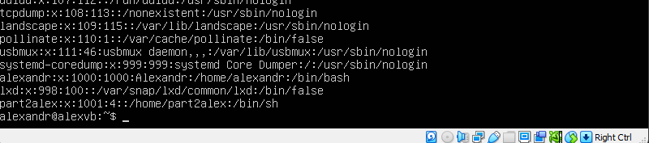
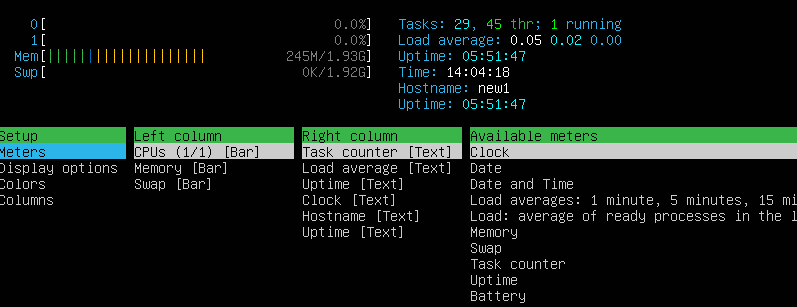

## Part 1. Установка ОС

## Part 2. Создание пользователя

## Part 3. Настройка сети ОС

> sudo vim /etc/hostname - Задать название машины \
> timedatectl - Проверка текущей даты и времени \
> timedatectl list-timezones - чтобы получить список всех доступных часовых поясов \
> sudo timedatectl set-timezone Asia/Krasnoyarsk

---

### Внутренний сетевой интерфейс lo(loopback) направлен на локальную машину и имеет IP 127.0.0.1.

> ip a или ifconfig

---

### Dynamic Host Configuration Protocol (DHCP) — автоматический предоставляет IP адреса и прочие настройки сети (маску сети, шлюз и т.п) компьютерам и различным устройствам в сети.

> sudo dhclient -v \
> less /var/lib/dhcp/dhclient.leases

> wget -qO- eth0.me - Внешний IP

---

---

> sudo nano /etc/netplan/00-installer-config.yaml

Меняем:

Перезагружаем и пингуем:

## Part 4. Обновление ОС

## Part 5. Использование команды sudo

`sudo (англ. Substitute User and do, дословно «подменить пользователя и выполнить»)` — программа для системного администрирования UNIX-систем, позволяющая делегировать те или иные привилегированные ресурсы пользователям с ведением протокола работы. Основная идея — дать пользователям как можно меньше прав, при этом достаточных для решения поставленных задач. Программа поставляется для большинства UNIX и UNIX-подобных операционных систем.

Команда sudo предоставляет возможность пользователям выполнять команды от имени суперпользователя root, либо других пользователей. Правила, используемые sudo для принятия решения о предоставлении доступа, находятся в файле `/etc/sudoers` (для редактирования файла можно использовать специальный редактор visudo, запускаемый из командной строки без параметров, в том числе без указания пути к файлу); язык их написания и примеры использования подробно изложены в man sudoers.

> usermod -a -G sudo <имя пользователя> \
> sudo hostnamectl set-hostname 1

## Part 6. Установка и настройка службы времени

## Part 7. Установка и использование текстовых редакторов

## `VIM`

> Чтобы сохранить и выйти нужно прописать :wq

> Основные действия по поиску в Vim: \
> Нажмите /. \
> Введите шаблон поиска. \
> Нажмите Enter, чтобы выполнить поиск. \
> Нажмите n, чтобы найти следующее вхождение или N чтобы найти \ предыдущее вхождение.

> :{пределы}s/{что заменяем}/{на что заменяем}/{опции} \
> :s /po /na

## `NANO`

> Чтобы сохранить файл, нажимает ctrl + x и подтверждаем сохранение файла на Y.

> Для поиска используем ctrl + w \
> Чтобы найти и заменить текст ctrl + \

## `MCEDIT`

> Что бы сохранить файл нажимаем F2 или нажимаем F10, что бы выйти и сохраняем файл.

> Ставим курсор в начало файла и нажимаем F7 для поиска

> Ставим курсор в начало файла и нажимаем F4 для поиска и пишем на что заменить

## Part 8. Установка и базовая настройка сервиса SSHD

1. Обновите репозиторий командой:

   > sudo apt update

2. Установите SSH с помощью команды:

   > sudo apt-get install ssh

3. Установите OpenSSH:

   > sudo apt install openssh-server

4. Добавьте пакет SSH-сервера в автозагрузку:

   > sudo systemctl enable sshd

5. Проверьте работу SSH:
   > systemctl status sshd

Откройте конфигурационный файл в текстовом редакторе:

> sudo nano /etc/ssh/sshd_config

В sshd_config замените порт 22 на другое значение в диапазоне от 1 до 65 535. Важно, чтобы выбранный порт не был занят другой службой:

---

### Команда ps выводит список текущих процессов на вашем сервере. Используется обычно в сочетании с командой grep и more или less.

#### Примечание: more и less - дополнительные команды, которые помогают фильтровать и разбивать на страницы выходные данные ps, так как они часто бывают довольно длинными.

> ps aux | grep sshd

#### Чтобы просмотреть все запущенные процессы, используйте одну из следующих команд:

> ps -e

#### или:

> ps -A

#### Если вы хотите найти все процессы, выполняемые конкретным пользователем, выполните следующую команду, указав имя пользователя:

> ps U

#### Опция x в ps перечисляет процессы без управляющего терминала. В основном это процессы, которые запускаются во время загрузки и работают в фоновом режиме.

> grep sshd показывает фильтр только по sshd

> netstat -tan

## Part 9. Установка и использование утилит top, htop

## `top`

---

### **Сведения о системе**

`Up` — время работы системы с последнего запуска.

`User` — количество текущих пользователей.

`Load average` — средняя нагрузка на сервер: отображаются значения за одну, пять и 15 минут назад. 

`Tasks` — общее количество запущенных процессов в разных статусах (running — выполняемые; sleeping — в ожидании; stopped — остановленные; zombie — «зомби», дочерние процессы, ожидающие завершения родительского процесса). 

`Cpu(s)` — процент времени процессора, затраченного на выполнение процессов, в том числе:

- us — пользовательские процессы (высокое значение данного показателя может указывать, в том числе, на проблемы в коде сайта, необходимость его оптимизации);

- sy — процессы ядра;

- id — неиспользуемые ресурсы (чем выше этот показатель, тем лучше);

- wa — операции ввода/вывода, т.е. дисковые операции.

`Mem, Swap` — сведения об использовании оперативной памяти (total — общий объем, free — объем свободной памяти, used — объем использованной памяти).

---

### **Сведения о процессах**

По умолчанию процессы выстроены в таблице по размеру нагрузки на процессор, от большего значения к меньшему.

Обозначения столбцов:

`PID` — идентификатор процесса;

`USER` — пользователь, запустивший процесс;

`PR` — приоритет процесса;

`NI` — измененный приоритет (присвоенный пользователем с помощью команды nice);

`VIRT` — объем используемой виртуальной памяти (здесь выводится тот объем памяти, который был запрошен процессом, даже если фактически используется меньше);

`RES` — объем используемой оперативной памяти (в данном случае, если процесс запросил 50Мб памяти, а использует 10Мб, будет выведено 10Мб);

`SHR` — объем памяти, разделяемой с другими процессами (т.е. память, которая может быть использована другими процессами);

`S` — статус процесса (running — запущен; sleeping — в ожидании; zombie — процесс-«зомби»);

`%CPU` — процент использования процессорного времени;

`%MEM` — процент использования оперативной памяти;

`TIME` — общее время работы процесса;

`COMMAND` — имя процесса (команда, которой был запущен процесс).

---

### **Управление**

Для работы с утилитой top используются следующие клавиши:

Пробел — обновить вывод

`M` — сортировка по используемой памяти

`P` — сортировка по нагрузке на процессор (используется по умолчанию)

`T` — сортировка по времени работы процесса

`A` — сортировка по максимальному потреблению различных ресурсов

`u` — сортировка по имени пользователя (потребуется ввести имя пользователя)

`k` — завершить процесс (потребуется указать его идентификатор, PID)

`n` — изменить количество процессов в выводе (потребуется указать нужное количество)

`c` — вывести полный путь запущенного процесса (столбец COMMAND)

`h` — вывод справки

`q` — выход из программы

---

pid процесса занимающего больше всего памяти 
pid процесса, занимающего больше всего процессорного времени

---

## `htop`

По умолчанию процессы отсортированы по уровню нагрузки на процессор, от большего к меньшему.

Чтобы отсортировать их по занятой памяти (или любому другому параметру), просто кликните на название нужного столбца, например MEM. Для обратной сортировки (от меньшего к большему) достаточно кликнуть на тот же столбец еще раз. Также для управления сортировкой можно использовать клавиши `M` (сортировка по памяти), `P` (по процессору), `T` (по времени), аналогично утилите top.

### Дополнительно используются:

Пробел — отметить процесс (таким образом можно помечать процессы для групповой операции с ними, например, завершения).

`u` — вывести процессы конкретного пользователя.

Для управления используются клавиши F1 – F10:

`F1` — вывод справки

`F2` — настройка вывода (добавление, удаление столбцов, отображение расширенной информации в верхнем блоке и пр.)

`F3` — поиск процессов

`F4` — фильтрация процессов (вывод процессов, имеющих в названии указанное слово)

`F5` — вывод дерева процессов (родительские и дочерние процессы)

`F6` — изменить тип сортировки

`F7 / F8` — повышение / понижение приоритета

`F9` — завершение процесса (в отличие от top, не требуется указание PID — просто выделите с помощью мыши или клавиатуры нужный процесс и нажмите F9. Для подтверждения завершения процесса нажмите Enter, для отмены — Esc).

`F10` — выход из программы

---

### Сортировка по PID

### Сортировка по PERCENT_CPU

### Сортировка по PERCENT_MEM

### Сортировка по TIME

### Фильтр по процессу sshd

### Поиск процесса syslog

### Добавление вывода hostname, clock и uptime

## Part 10. Использование утилиты fdisk

> Название диска - VBOX HARDDISK \
> Размер диска - 15GiB \
> Количество секторов - 31457280 \
> Размер swap 2009084

## Part 11. Использование утилиты df

### `df`

> Размер раздела - 10218772 \
> Размер занятого пространства - 5292936 \
> Размер свободного пространства - 4385164 \
> Процент использования - 55% \
> 1K-block = 1024 bytes

### `df -Th`

> Размер раздела - 9.8G \
> Размер занятого пространства - 5.1G \
> Размер свободного пространства - 4.2G \
> Процент использования - 55% \
> Тип файловой системы - ext4

## Part 12. Использование утилиты du

`du`

`Размер папок /home, /var, /var/log в байтах`

`Размер папок /home, /var, /var/log в человекочитаемом виде`

`Размер всего содержимого в /var/log (не общее, а каждого вложенного элемента, используя *)`

## Part 13. Установка и использование утилиты ncdu

`Размер папки /home`

`Размер папки /var`

`Размер папки /var/log`

## Part 14. Работа с системными журналами

`/var/log/dmesg`

`/var/log/syslog`

`/var/log/auth.log`

`Последняя успешная авторизация`

`Перезапускаем службу SSHd`

> sudo systemctl restart ssh.service

## Part 15. Использование планировщика заданий CRON

`Список текущих заданий для CRON`

> crontab -l

`/var/log/syslog`

`Удаление всех заданий из планировщика`

> crontab -r

